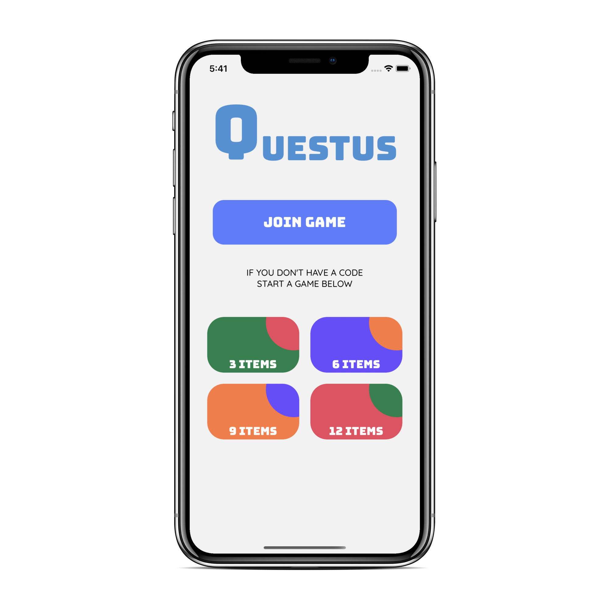
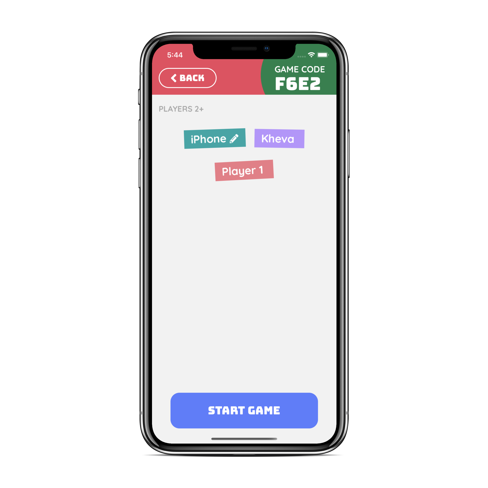
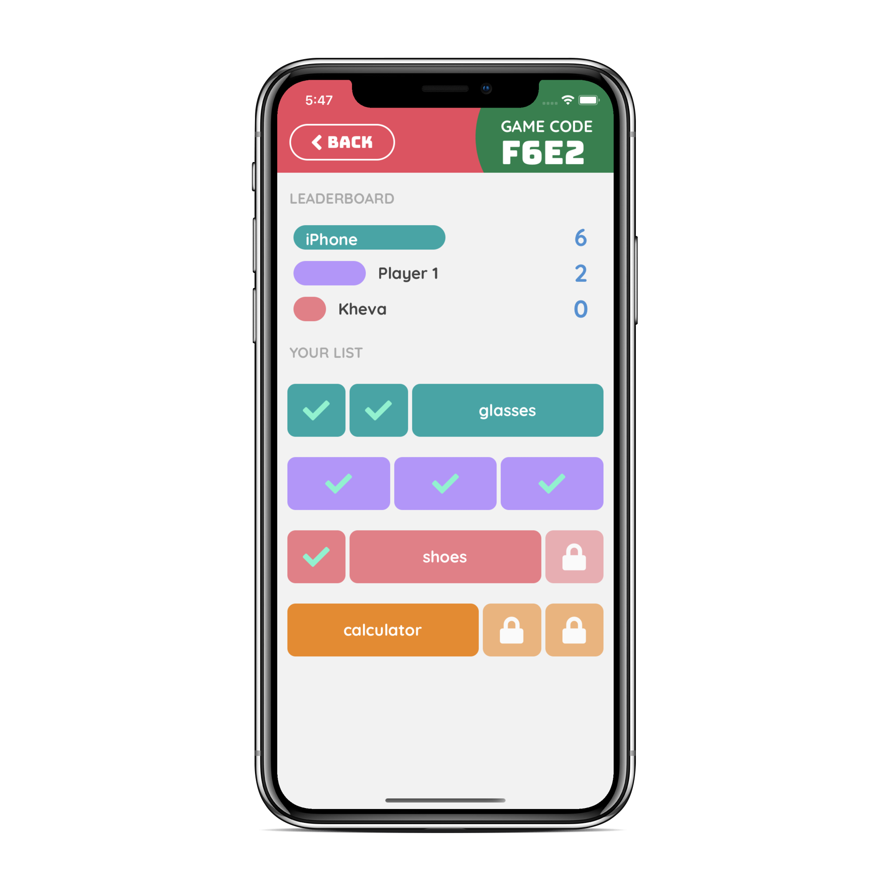
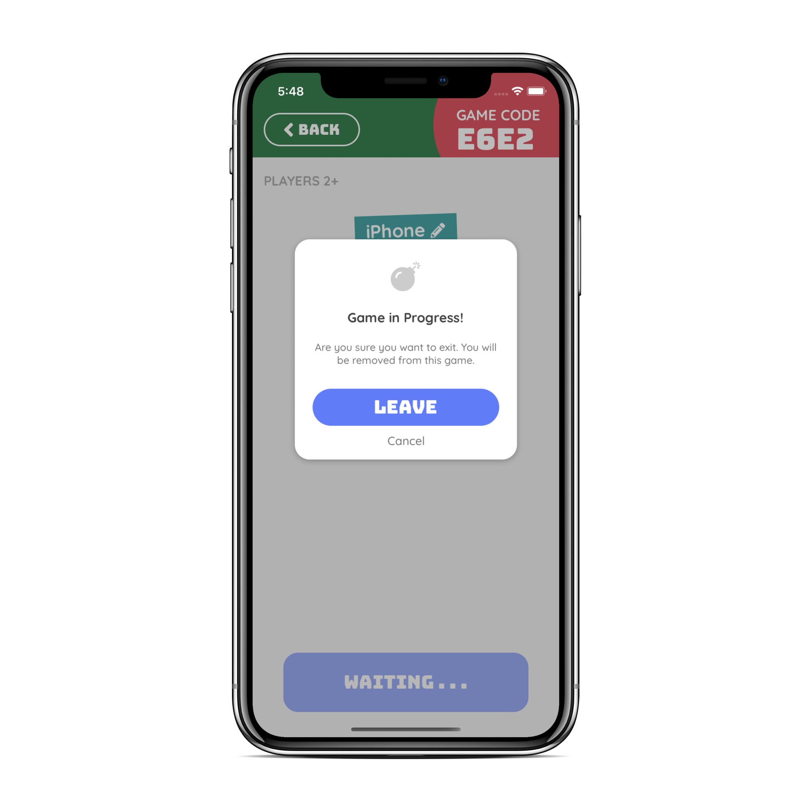

   

# Questus
Questus is an app that allows users to participate in scavenger hunts with their friends. Users can create a room and have their friends join using a unique GAME CODE.
I built this app for my CPE 400 class as an independent project.

## Screenshots

Home                                        |  Game Lobby
:------------------------------------------:|:-------------------------:
  |  

Play Game                                        |  Game Alerts
:-----------------------------------------------:|:-------------------------:
  |  
